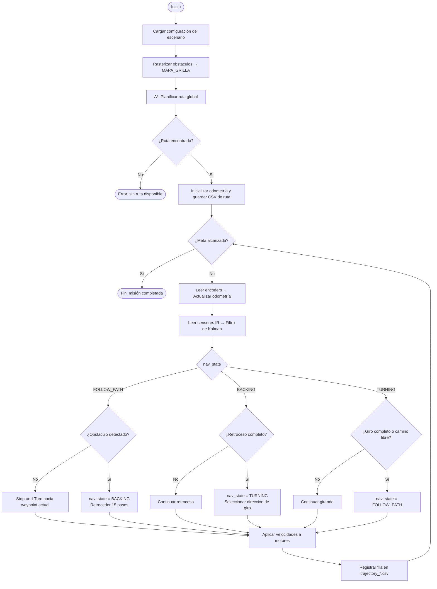
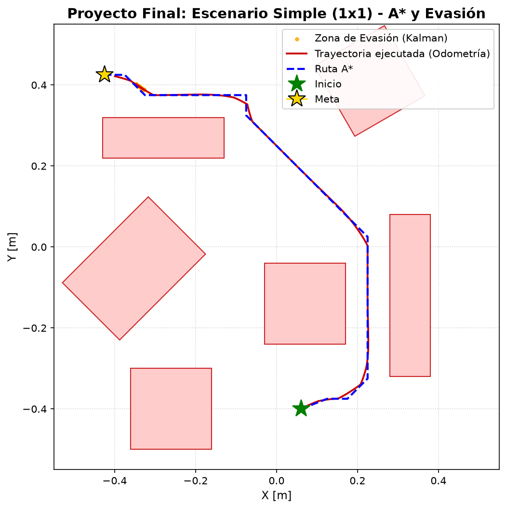
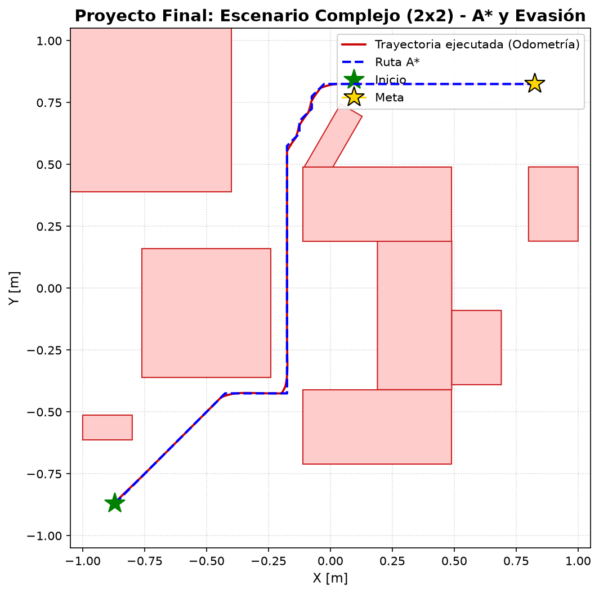
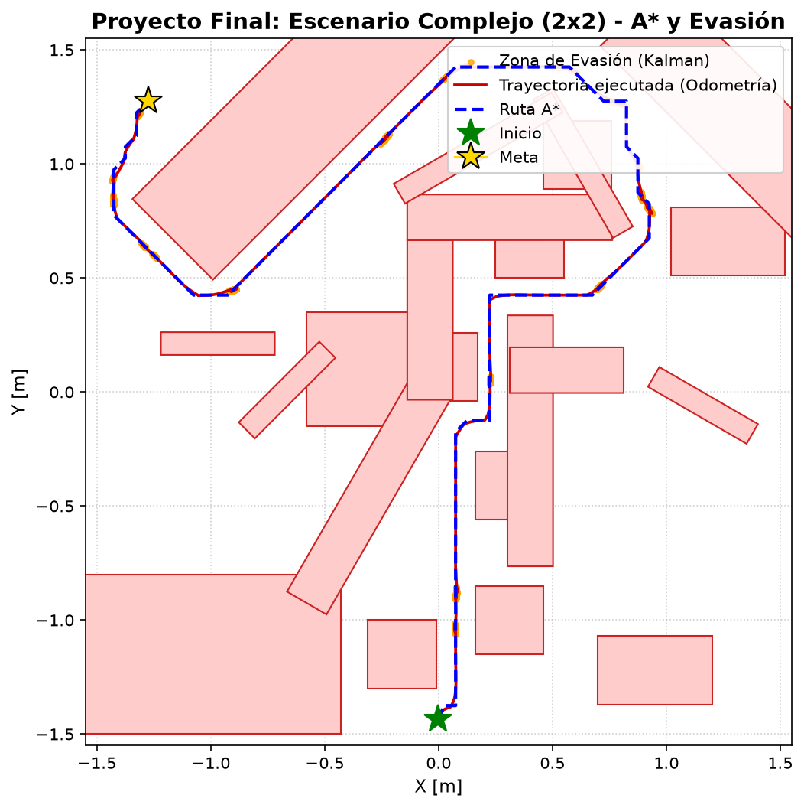

# Navegación Autónoma con Planificación de Rutas A* en Webots

**Línea seleccionada:** Planificación de Rutas

## Integrantes del grupo

| Nombre |
|--------|
| Felipe Astudillo| 
| Martina Sandoval|
| Julian Guerrero|

---

## Objetivo del proyecto

Desarrollar un sistema de navegación autónoma para el robot diferencial E-puck en el simulador Webots, implementando el algoritmo A* para la planificación global de rutas sobre un mapa discretizado en celdas, complementado con un controlador de seguimiento de waypoints y una capa de evasión reactiva de obstáculos basada en sensores infrarrojos. El sistema se evalúa en tres entornos de complejidad creciente, midiendo la trayectoria real ejecutada frente a la ruta planificada.

---

## Descripción del robot, sensores y actuadores

**Plataforma de simulación:** Webots R2023b  
**Robot:** E-puck (tracción diferencial)

### Actuadores

| Dispositivo | Especificación |
|-------------|---------------|
| Motor izquierdo (`left wheel motor`) | Velocidad máxima: 6.28 rad/s |
| Motor derecho (`right wheel motor`) | Velocidad máxima: 6.28 rad/s |
| Radio de rueda | 20.5 mm |
| Distancia entre ejes | 52 mm |

### Sensores

| Sensor | Uso en el proyecto |
|--------|--------------------|
| 8 sensores IR de proximidad (`ps0`–`ps7`) | Detección de obstáculos imprevistos |
| Encoders de ruedas (izquierdo y derecho) | Odometría para estimar posición `(x, y, φ)` |

Los sensores frontales y diagonales (`ps0`, `ps1`, `ps6`, `ps7`) se fusionan mediante un **Filtro de Kalman escalar** para suavizar las lecturas ruidosas y estimar la distancia al obstáculo más cercano.

### Modelo de odometría

En cada paso de simulación (32 ms):

```
ds_l = R · Δθ_izquierda
ds_r = R · Δθ_derecha
ds   = (ds_l + ds_r) / 2
dφ   = (ds_r - ds_l) / L

x_{k+1} = x_k + ds · cos(φ_k + dφ/2)
y_{k+1} = y_k + ds · sin(φ_k + dφ/2)
φ_{k+1} = φ_k + dφ
```

Donde `R = 0.0205 m` (radio) y `L = 0.052 m` (base).

---

## Descripción de los escenarios de prueba

Se crearon tres mundos en Webots de complejidad creciente. Todos comparten el mismo controlador; el escenario se selecciona con la variable `ESCENARIO_ACTUAL` en `controllers/robot_controller/robot_controller.py`.

| Escenario | Archivo | Arena | Grilla | Inicio → Meta | Obstáculos |
|-----------|---------|-------|--------|---------------|-----------|
| **SIMPLE** | `worlds/simple.wbt` | 1×1 m | 20×20 | (0.06, -0.40) → (-0.41, 0.41) | 6 bloques |
| **COMPLEJO** | `worlds/complejo.wbt` | 2×2 m | 40×40 | (-0.87, -0.87) → (0.80, 0.80) | 7 bloques + 2 cilindros |
| **MUY_COMPLEJO** | `worlds/complejo2.wbt` | 3×3 m | 60×60 | (-0.00, -1.44) → (-1.25, 1.25) | 22 obstáculos mixtos |

Todos los obstáculos se definen con posición `(x, y)`, tamaño `(ancho, alto)` y ángulo de rotación. La grilla usa celdas de **5 cm** con una inflación de seguridad de **5 cm** alrededor de cada obstáculo.

---

## Explicación del algoritmo implementado

El sistema combina tres capas de control:

### 1. Planificación global: A*

Se construye un mapa binario (`MAPA_GRILLA`) rasterizando los obstáculos del mundo con rotación e inflación. Sobre este mapa se ejecuta A* con:

- **8 vecinos** (movimiento en las 4 direcciones cardinales y las 4 diagonales)
- **Sin corte de esquinas:** en movimientos diagonales, ambas celdas ortogonales deben estar libres
- **Heurística:** distancia euclidiana al nodo meta
- **Costo de arista:** distancia euclidiana entre celdas (1.0 para ortogonal, √2 para diagonal)

El resultado es una lista de **waypoints** (coordenadas de mundo) que el robot debe seguir en orden.

### 2. Seguimiento de waypoints: Stop-and-Turn

Para cada waypoint activo se calcula el error de orientación. Si el error supera **0.15 rad**, el robot se detiene y gira en el lugar antes de avanzar:

```
error_ángulo = atan2(sin(θ_objetivo - φ_k), cos(θ_objetivo - φ_k))

Si |error_ángulo| > 0.15 rad:
    v_lin = 0                    # Detener traslación
    ω     = 3.0 · error_ángulo   # Solo girar

Si no:
    v_lin = 0.06 m/s             # Avanzar
    ω     = 2.0 · error_ángulo   # Corrección suave

v_izq = (v_lin - ω·L/2) / R
v_der = (v_lin + ω·L/2) / R
```

Un waypoint se da por alcanzado cuando la distancia euclidiana al robot es menor a **2.5 cm**.

### 3. Evasión reactiva

Como el mapa A* infla obstáculos, el robot confía en la ruta planificada. La evasión solo se activa ante colisiones inminentes (lectura IR > 2000/4095 ≈ 48.8 % del rango). El sistema usa una **máquina de 3 estados**:

| Estado | Acción |
|--------|--------|
| `FOLLOW_PATH` | Navegación normal hacia waypoints |
| `BACKING` | Retrocede 15 pasos para desengancharse del obstáculo |
| `TURNING` | Gira hasta que el camino quede despejado (20–120 pasos); detecta el lado menos bloqueado por los sensores |

Un mecanismo anti-atasco detecta si el robot activa evasión `≥ 4` veces en una ventana de 600 pasos y ejecuta un giro de escape forzado de 90 pasos en la dirección opuesta a la última.

---

## Diagrama de flujo de la solución



### Pseudocódigo del A*

```
función A_STAR(mapa, inicio, meta):
    abiertos  ← cola de prioridad con (f=h(inicio,meta), inicio)
    cerrados  ← conjunto vacío
    g[inicio] ← 0
    padre[·]  ← {}

    mientras abiertos no vacío:
        actual ← extraer nodo con menor f

        si actual == meta:
            reconstruir y retornar camino desde padre[·]

        cerrados.agregar(actual)

        para cada vecino en 8_vecinos(actual):
            si vecino fuera de límites o mapa[vecino] == OCUPADO:
                continuar
            si es diagonal y alguna celda ortogonal está ocupada:
                continuar   // sin corte de esquinas

            g_tentativo ← g[actual] + distancia_euclidiana(actual, vecino)

            si vecino en cerrados y g_tentativo ≥ g[vecino]:
                continuar

            si g_tentativo < g[vecino] o vecino no en abiertos:
                padre[vecino]  ← actual
                g[vecino]      ← g_tentativo
                f[vecino]      ← g_tentativo + distancia_euclidiana(vecino, meta)
                abiertos.insertar(f[vecino], vecino)

    retornar SIN_RUTA
```

---

## Resultados obtenidos y métricas de desempeño

Las métricas se calculan a partir de los archivos CSV generados durante la simulación.

| Escenario | Waypoints planificados | Pasos de simulación | Duración | Activaciones de evasión | Éxito |
|-----------|----------------------|---------------------|----------|------------------------|-------|
| SIMPLE | 25 | 901 | 28.8 s | 35 | ✓ |
| COMPLEJO | 57 | 1,687 | 54.0 s | 0 | ✓ |
| MUY_COMPLEJO | 122 | 7,337 | 234.8 s | 1,890 | ✓ |

**Observaciones:**
- En **SIMPLE**, la evasión se activa 35 veces debido al espacio reducido (1×1 m) y la cercanía de los obstáculos.
- En **COMPLEJO**, la ruta A* es suficientemente buena para llegar sin ninguna evasión reactiva.
- En **MUY_COMPLEJO**, el elevado número de activaciones (1,890) refleja la densidad de obstáculos y la longitud de la misión (≈ 235 s). El robot logra completar la ruta gracias al mecanismo anti-atasco.

### Trayectorias ejecutadas

**Escenario SIMPLE (1×1 m)**


**Escenario COMPLEJO (2×2 m)**


**Escenario MUY COMPLEJO (3×3 m)**


> **Leyenda de los gráficos:**  
> — Línea azul discontinua: ruta planificada por A*  
> — Línea roja continua: trayectoria real ejecutada (odometría)  
> — Puntos naranjas: activaciones del sistema de evasión reactiva  
> — ★ Verde: posición inicial | ★ Dorado: posición meta

---

## Videos de la simulación

| Escenario | Enlace |
|-----------|--------|
| SIMPLE | [Video Escenario Simple](analysis/Videos/simple.mp4) |
| COMPLEJO | [Video Escenario Complejo](analysis/Videos/complejo.mp4) |
| MUY_COMPLEJO | [Video Escenario Muy Complejo](analysis/Videos/complejo2.mp4) |

---

## Instrucciones para ejecutar la simulación

### Requisitos

- [Webots R2023b](https://cyberbotics.com/) (o versión compatible)
- Python 3.8+
- Dependencias Python:

```bash
pip install pandas matplotlib numpy
```

### Pasos

**1. Clonar el repositorio**

```bash
git clone <URL_DEL_REPOSITORIO>
cd Robotica_final
```

**2. Seleccionar el escenario**

Editar la línea 11 de `controllers/robot_controller/robot_controller.py`:

```python
# Opciones: "SIMPLE", "COMPLEJO", "MUY_COMPLEJO"
ESCENARIO_ACTUAL = "SIMPLE"
```

**3. Abrir el mundo correspondiente en Webots**

| Escenario | Archivo a abrir |
|-----------|----------------|
| SIMPLE | `worlds/simple.wbt` |
| COMPLEJO | `worlds/complejo.wbt` |
| MUY_COMPLEJO | `worlds/complejo2.wbt` |

En Webots: `File → Open World` y seleccionar el archivo `.wbt`.

**4. Ejecutar la simulación**

Presionar el botón **Play** (▶) en Webots. El controlador Python se inicia automáticamente. Los archivos CSV se generan en:

```
controllers/robot_controller/planned_path_<ESCENARIO>.csv
controllers/robot_controller/trajectory_<ESCENARIO>.csv
```

**5. Visualizar resultados**

```bash
cd analysis
python plot_comparison.py
```

El script detecta automáticamente el CSV más reciente y genera la imagen de análisis de trayectoria.

---

## Conclusiones, limitaciones y posibles mejoras

### Conclusiones

- El algoritmo A* garantiza la ruta óptima en el mapa discretizado para todos los escenarios probados. La inflación de 5 cm en los obstáculos proporciona un margen de seguridad adecuado para el radio del robot.
- La estrategia Stop-and-Turn permite un control preciso del ángulo en cada waypoint sin necesidad de un controlador PID de orientación complejo.
- La combinación de planificación global (A*) con evasión reactiva local permite completar misiones incluso cuando la odometría acumula error y el robot se desvía ligeramente de la ruta planificada.

### Limitaciones

| Limitación | Descripción |
|-----------|-------------|
| **Deriva odométrica** | La odometría acumula error a lo largo del tiempo. En MUY_COMPLEJO (≈235 s) la posición estimada diverge significativamente de la posición real. |
| **Mapa estático** | El mapa se construye al inicio con los obstáculos del archivo `.wbt`. Obstáculos dinámicos o no declarados no se integran al plan. |
| **Evasión reactiva simple** | El esquema retroceso-giro puede fallar en pasillos estrechos o ante obstáculos irregulares, generando bucles de atasco. |
| **Sin relocalización** | El robot no tiene forma de corregir su pose estimada; no se usan landmarks ni GPS. |
| **Mapa de celdas cuadradas** | La discretización a 5 cm introduce un error geométrico en curvas y diagonales largas. |

### Posibles mejoras

- **Replanificación dinámica (D\*):** Actualizar la ruta en tiempo real ante obstáculos no mapeados, sin recalcular desde cero.
- **Control PID de orientación:** Reemplazar el Stop-and-Turn por un controlador proporcional-integral-derivativo para trayectorias más suaves y rápidas.
- **Fusión sensorial con IMU:** Combinar la odometría con una unidad de medición inercial para reducir la deriva en misiones largas.
- **SLAM (Simultaneous Localization and Mapping):** Construir y actualizar el mapa mientras el robot navega, eliminando la dependencia del mapa estático preprogramado.
- **Campos potenciales artificiales:** Sustituir o complementar la evasión reactiva con un campo repulsivo alrededor de los obstáculos para trayectorias de evasión más fluidas.
